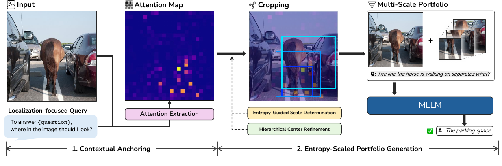

# Visual Funnel: Resolving Contextual Blindness in Multimodal Large Language Models [CVPR 2026]

Official implementation of **Visual Funnel**, a training-free inference method
for visual question answering with multimodal large language models.

> Accepted to CVPR 2026 (Findings). [[Paper](https://arxiv.org/abs/2512.10362)]
> [[PDF](https://arxiv.org/pdf/2512.10362)]

<p align="center">
  
</p>

---

## Overview

Visual Funnel addresses **contextual blindness**: a failure mode where an MLLM
can localize a fine-grained visual detail, but cannot connect that detail to the
surrounding context needed to answer the question.

Given an image and a question, Visual Funnel:

1. extracts a contextual attention map with a localization-focused prompt,
2. computes attention entropy,
3. constructs a hierarchical visual portfolio,
4. answers using the original image and three contextual crops.

Default portfolio:

```text
original, focal, alpha1, alpha2
```

Default scale functions:

```text
alpha1 = 1.2 + 0.6 * H_norm
alpha2 = 1.6 + 1.2 * H_norm
```

---

## Installation

```bash
pip install -r requirements.txt
```

Tested with Qwen2.5-VL in a CUDA environment. The provided shell scripts assume
a conda environment named `vf-qwen25`, but the Python entrypoints can be run in
any equivalent environment.

---

## Quick Start

```bash
bash scripts/smoke_qwen2_5_visual_funnel.sh \
  --image /path/to/image.jpg \
  --question "What is written on the sign?"
```

## Evaluation

Run Visual Funnel on a dataset:

```bash
python run.py \
  --model qwen2_5 \
  --task textvqa \
  --save_path ./results \
  --overwrite
```

For a small sanity run:

```bash
python run.py \
  --model qwen2_5 \
  --task textvqa \
  --max_samples 20 \
  --save_path ./results_subset \
  --overwrite
```

Score predictions:

```bash
python get_score.py \
  --data_dir ./results \
  --save_path ./results
```

---

## Data

Dataset paths are configured in `info.py`.

Each dataset JSON entry should follow:

```json
{
  "id": "example-id",
  "question": "What is written on the sign?",
  "labels": ["answer"],
  "image_path": "relative/path/to/image.jpg"
}
```

You can also override paths directly:

```bash
python run.py \
  --model qwen2_5 \
  --task textvqa \
  --question_path_override /path/to/data.json \
  --image_path_override /path/to/images \
  --save_path ./results \
  --overwrite
```

## Output

The runner writes:

```text
{save_path}/{model}-{task}-visual_funnel.json
```

Each row includes the model's original answer, Visual Funnel answer, focal crop
box, and portfolio metadata.

---

## Citation

If you find this repository useful, please cite:

```bibtex
@article{jung2025visualfunnel,
  title   = {Visual Funnel: Resolving Contextual Blindness in Multimodal Large Language Models},
  author  = {Jung, Woojun and Go, Jaehoon and Jeon, Mingyu and Yoon, Sunjae and Kim, Junyeong},
  journal = {arXiv preprint arXiv:2512.10362},
  year    = {2025}
}
```

The citation will be updated with proceedings metadata when it becomes
available.
